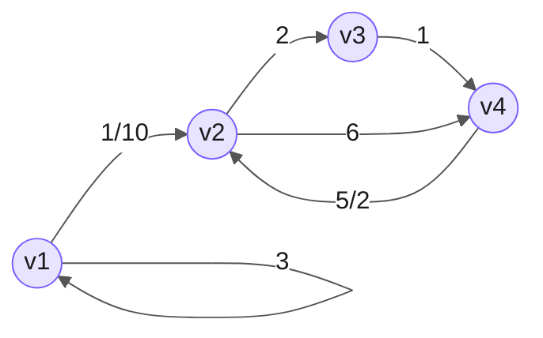
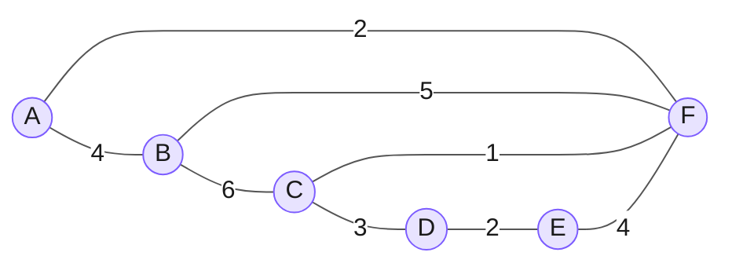
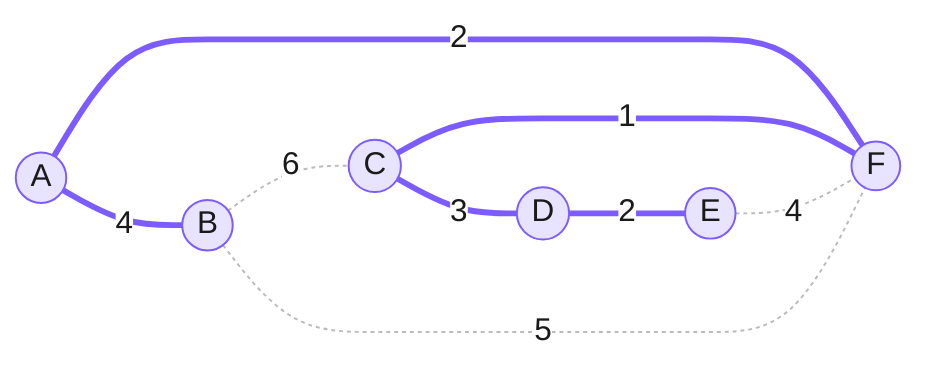

# 5. Grafové algoritmy

> **Zadání:** Ohodnocené grafy, definice nejkratší cesty, minimální kostry grafu, algoritmy pro hledání nejkratších cest (Dijkstrův, Bellman-Fordův algoritmus) a minimálních koster v grafu. (IB000, IB002)

# Ohodnocený graf

Definici grafu viz [[04-Grafy-prohledavani|4. otázka]].

> **Definice:** **Vážený graf** je graf $G$ spolu s ohodnocením $w$ hran reálnými čísly $w : E(G) \to \mathbb{R}$. Váženému grafu také někdy říkáme **ohodnocený**.

- **Ohodnocený (vážený) graf** $\Rightarrow$ každá hrana má přiřazenou hodnotu (**váhu**).

> **Vahou** (celkovou délkou) kostry $T \subseteq G$ váženého souvislého grafu $(G, w)$ rozumíme
> $$d_G^w(T) := \sum_{e \in E(T)} w(e),$$
> tj. součet vah všech hran této kostry.

Vážený graf lze reprezentovat **maticí vah** $W$ (analogie matice sousednosti, kde místo $1$ je váha hrany):

$$W = \begin{bmatrix} 3 & \tfrac{1}{10} & 0 & 0 \\ 0 & 0 & 2 & 6 \\ 0 & 0 & 0 & 1 \\ 0 & \tfrac{5}{2} & 0 & 0 \end{bmatrix}$$

Tatáž matice vah jako orientovaný ohodnocený graf (řádek = z vrcholu, sloupec = do vrcholu):



# Nejkratší cesta

> **Cesta** je posloupnost vrcholů. Existence cesty znamená **dosažitelnost**.

> **Definice:** Cesta v grafu $G = (V, E)$ je posloupnost vrcholů $p = \langle v_0, v_1, \ldots, v_k \rangle$ taková, že $(v_{i-1}, v_i) \in E$ pro $i = 1, \ldots, k$.

- **Jednoduchá cesta** $\Rightarrow$ vrcholy se neopakují.
- **Hamiltonovská cesta** je jednoduchá cesta, která projde všechny vrcholy grafu.

> **Alternativní terminologie:** cesta $\Rightarrow$ **sled**, jednoduchá cesta $\Rightarrow$ **cesta**.

## Délka cesty

**Délka cesty** $\Rightarrow$ počet hran. Pokud jsou hrany ohodnocené, pak **součet jejich hodnot (vah)**.

- Pokud cesta neexistuje, její délka je **nekonečno**.
- Pokud cesta obsahuje **záporný cyklus**, délka je **minus nekonečno**.

> **Definice:** Cesta $p = \langle v_0, v_1, \ldots, v_k \rangle$ je **nejkratší cestou** z vrcholu $v_0$ do vrcholu $v_k$ právě tehdy, když pro každou cestu $\bar{p}$ z $v_0$ do $v_k$ platí $w(\bar{p}) \geq w(p)$.

## Vlastnosti nejkratší cesty

- Jestliže mezi dvojicí vrcholů grafu existuje nejkratší cesta, tak mezi nimi existuje taková nejkratší cesta, která je **jednoduchá**.
- **Každá podcesta nejkratší cesty je nejkratší cestou.**

**Využití** $\Rightarrow$ hledání nejkratší cesty na mapě (GPS), v počítačových sítích, rozhodovací systémy.

## Varianty problému

- **Nejkratší cesty z vrcholu do všech vrcholů** $\Rightarrow$ **SSSP** (Single Source Shortest Path).
- **Nejkratší cesty ze všech vrcholů do daného vrcholu**
  - Pro neorientované grafy totožné se SSSP.
  - Pro orientované grafy stačí graf transponovat a pak řešit SSSP.
- **Nejkratší cesty mezi dvojicemi vrcholů** $\Rightarrow$ opět SSSP.

Speciální případy:

- U **neohodnoceného** grafu lze SSSP zjistit pomocí **BFS**.
- U **acyklického** grafu relaxací hran v **topologickém uspořádání**.

## Uspořádání

**Uspořádání** je binární relace na množině.

- **Částečné uspořádání**
  - $1 \leq 1,\ 2 \leq 2,\ 3 \leq 3$ (reflexivita)
  - $1 \leq 2,\ 1 \leq 3$ (další relace)
- **Lineární uspořádání**
  - $a \leq a,\ b \leq b,\ c \leq c$ (reflexivita)
  - $a \leq b,\ b \leq c,\ a \leq c$ (další relace)

# Dijkstrův algoritmus

**Nejrychlejší** známý algoritmus řešící **SSSP**, využívá **prioritní frontu**.

> **Vstupní podmínka:** vyžaduje **nezáporně** ohodnocené grafy.

- Se zápornými hranami nedokáže najít nejkratší cestu, protože se nevrací k již prohledaným uzlům.
- Nedokáže detekovat záporné cykly.
- **Narozdíl od BFS se řídí hodnotou hran, ne jen jejich počtem.**

Prioritní fronta se řídí podle **nejnižší vzdálenosti od zdroje**. Algoritmus bere vždy nejbližší uzel ve frontě a prozkoumá jeho potomky, případně aktualizuje jejich vzdálenost, pokud se podařilo najít kratší cestu (**relaxace hrany**).

## Složitost

Závisí na volbě datové struktury pro implementaci prioritní fronty:

| | cena `INSERT` | cena `EXTMIN` | cena `DECKEY` | celková složitost |
|---|---|---|---|---|
| pole | $\Theta(1)$ | $\Theta(V)$ | $\Theta(1)$ | $\Theta(V^2)$ |
| binární halda | $\Theta(\log V)$ | $\Theta(\log V)$ | $\Theta(\log V)$ | $\Theta(V \log V + E \log V)$ |
| Fibonacciho halda | $\Theta(1)$ | $\Theta(\log V)$ | $\Theta(1)$ | $\Theta(V \log V + E)$ |

Prostorová složitost je **lineární**.

## Pseudokód

```
function Dijkstra((V, E), w, s)
    InitSssp((V, E), s)
    S = ∅
    Insert(Q, s)
    while Q ≠ ∅ do
        u = ExtractMin(Q)
        S = S ∪ {u}
        foreach (u, v) ∈ E do
            if v.d == ∞ then  Insert(Q, v)
            if v.d > u.d + w(u, v) then
                Relax(u, v, w)
                DecreaseKey(Q, v, v.d)
```

- $Q$ je prioritní fronta.
- Prioritou vrcholu $u \in Q$ je hodnota $u.d$ (aktuální nejlepší vzdálenost od zdroje).
- $S$ je množina vrcholů, které už byly odebrány z prioritní fronty.

**Využití:**

- Hledání nejkratší cesty mezi dvěma vrcholy.

# Bellman-Fordův algoritmus

Pomalejší než Dijkstrův algoritmus, ovšem **nevadí mu záporné hrany**.

- Umí **detekovat záporný cyklus**.
- **Složitost:** $O(V \cdot E)$.
- Hlavním principem je opět **relaxace hran**.

## Pseudokód

```
function BellmanFord((V, E), w, s)
    InitSssp((V, E), s)
    // (V−1)× relaxuj všechny hrany
    for i = 1 to |V| − 1 do
        foreach (u, v) ∈ E do
            if v.d > u.d + w(u, v) then
                Relax(u, v, w)
    // kontrola záporného cyklu
    foreach (u, v) ∈ E do
        if v.d > u.d + w(u, v) then
            return "Graf obsahuje záporný cyklus."
    return true
```

- $\text{InitSssp}$ nastaví $s.d = 0$, ostatním $v.d = \infty$ a všem $v.\pi = \text{null}$.
- $\text{Relax}(u, v, w)$ nastaví $v.d = u.d + w(u, v)$ a $v.\pi = u$.
- Po $(|V|-1)$ průchodech jsou všechny nejkratší cesty nalezené; pokud lze ještě relaxovat, graf obsahuje **záporný cyklus**.

# Minimální kostra

**Minimální kostra** je tzv. minimální souvislý podgraf. Propojuje všechny vrcholy grafu s využitím těch nejméně ohodnocených hran $\Rightarrow$ minimální kostra má nejmenší dosažitelný součet vah hran.

- U neohodnoceného grafu má každá hrana délku $1$ $\Rightarrow$ minimální kostra má vždy délku $n - 1$.

> **Definice:** Podgraf $T \subseteq G$ souvislého grafu $G$ se nazývá **kostrou**, pokud
> - $T$ je stromem a
> - $V(T) = V(G)$, neboli $T$ propojuje všechny vrcholy $G$.

- Graf může mít více koster. Všechny kostry na grafu mají stejný počet vrcholů i hran.
- **Kostra je strom.**
- **Hamiltonovská cesta je kostrou, ale není minimální kostrou.**

**Užitečné** např. při budování dopravních a elektrických sítí tak, aby se ušetřil materiál.

> **Hladové algoritmy** využívají lokálního optima.

## Kruskalův hladový algoritmus

Funguje na grafech **se záporným cyklem**. Složitost je $O(E \log E)$ (pro merge sort implementaci řazení hran).

**Postup:**

1. Seřadí všechny hrany od nejmenší po největší (dle vah).
2. Poté přes seřazené hrany iteruje a skládá kostru $\Rightarrow$ vynechává hrany, kterými by vznikla kružnice / cyklus.
3. Za běhu si skládá množiny propojených uzlů (jsou disjunktní) a sjednocuje je v případě, že narazí na průnik (místo, kde se setkávají).

```
KRUSKAL(G):
    A = ∅
    For each vertex v ∈ G.V:
        MAKE-SET(v)
    For each edge (u, v) ∈ G.E ordered by increasing weight(u, v):
        if FIND-SET(u) ≠ FIND-SET(v):
            A = A ∪ {(u, v)}
            UNION(u, v)
    return A
```

![[kruskal.png|604]]
## Jarníkův (Primův) algoritmus

Hledá **minimální kostru ohodnoceného grafu**. Složitost je $O(E + V \log V)$.

1. Zvolí si libovolný vrchol v grafu.
2. Vybírá ze hran sousedících s propojenou částí vždy tu nejméně ohodnocenou tak, aby nevznikl cyklus. Postupně tak zvětšuje komponentu souvislosti, dokud neobsahuje všechny vrcholy.

```
T = ∅;
U = { 1 };
while (U ≠ V)
    let (u, v) be the lowest cost edge such that u ∈ U and v ∈ V - U;
    T = T ∪ {(u, v)}
    U = U ∪ {v}
```

![[jarnikuv-primuv-algoritmus.png|468]]
## Příklad

Vážený neorientovaný graf (šipky v obou grafech níže jsou pouze artefakt renderování v Obsidianu — graf je neorientovaný):



Jeho **minimální kostra** (zvýrazněné hrany, součet vah $= 1 + 2 + 2 + 3 + 4 = 12$):



- **Kruskal** přidává hrany v pořadí podle vah: $CF(1), AF(2), DE(2), CD(3), AB(4)$ – přeskočí $EF, BF, BC$, protože by uzavřely cyklus.
- **Prim** ze startu v $A$ roste: $AF(2), FC(1), CD(3), DE(2), AB(4)$ – jiné pořadí, **stejná kostra**.

# Otázky

**1.** Vysvětli Dijkstrův algoritmus. Jakou má složitost? Jaký je jeho invariant? Pseudokód? Popiš rozdíly oproti BFS.
> **Odpověď:** Dijkstrův algoritmus řeší SSSP na **nezáporně** ohodnoceném grafu pomocí **prioritní fronty** řazené podle vzdálenosti od zdroje. Vždy odebere nejbližší vrchol, přidá ho do hotové množiny $S$ a relaxuje jeho hrany. **Invariant:** jakmile je vrchol odebrán z fronty, jeho vzdálenost $u.d$ je už finální (nejkratší). **Složitost** závisí na frontě – $\Theta(V^2)$ s polem, $\Theta((V+E)\log V)$ s binární haldou, $\Theta(V \log V + E)$ s Fibonacciho haldou. **Oproti BFS** se řídí váhou hran, ne jen jejich počtem (BFS je vlastně Dijkstra na neohodnoceném grafu).

**2.** Jak funguje Bellman-Fordův algoritmus, k čemu se používá?
> **Odpověď:** Řeší SSSP i pro grafy se **zápornými hranami**. $(V-1)$-krát relaxuje **všechny** hrany, čímž zaručí nalezení nejkratších cest. Závěrečným průchodem dokáže **detekovat záporný cyklus** (pokud lze ještě relaxovat). Složitost $O(V \cdot E)$ – pomalejší než Dijkstra.

**3.** Co je to cesta? Řekni definici. K čemu nám to je?
> **Odpověď:** Cesta je posloupnost vrcholů $\langle v_0, \ldots, v_k \rangle$, kde sousední dvojice jsou spojeny hranou; existence cesty znamená **dosažitelnost**. **Jednoduchá cesta** neopakuje vrcholy. Slouží k modelování propojení a hledání nejkratších tras (mapy, sítě).

**4.** Jak se hledá nejkratší cesta?
> **Odpověď:** Záleží na grafu: v **neohodnoceném** grafu **BFS**, v **acyklickém** relaxací v topologickém uspořádání, v **nezáporně ohodnoceném** **Dijkstra**, při **záporných hranách** **Bellman-Ford**. Princip je vždy **relaxace hran** – postupné zpřesňování odhadu vzdálenosti.

**5.** Co je to kostra? K čemu je ta minimální? Popiš algoritmy pro její hledání. Jak funguje Primův a Kruskalův algoritmus?
> **Odpověď:** **Kostra** je podgraf, který je stromem a propojuje všechny vrcholy ($n-1$ hran). **Minimální kostra** má nejmenší součet vah – využití při stavbě sítí (úspora materiálu). **Kruskal:** seřadí hrany dle vah a hladově přidává ty, které netvoří cyklus (správa disjunktních množin), $O(E \log E)$. **Prim (Jarník):** od jednoho vrcholu postupně přidává nejlevnější hranu vedoucí ven z už propojené komponenty, $O(E + V \log V)$.

# Otázky z ISu

> Otázky pocházejí ze společné testové sekce *Algoritmy a datové struktury*. U tvrzení typu ano/ne nebyla v exportu z ISu vyznačena správná odpověď — je doplněna podle standardních výsledků.

**1.** Je následující tvrzení pravdivé? „Dijkstrův algoritmus pro hledání nejkratších cest funguje korektně na grafech bez záporně ohodnocených hran."
- ✅ ano
- ne

**2.** Je dán orientovaný graf $G = (V, E)$, jehož hrany jsou ohodnoceny přirozenými čísly, a dva vrcholy $s$, $t$ tohoto grafu. Je následující tvrzení pravdivé? „Dijkstrův algoritmus najde nejkratší cestu z vrcholu $s$ do vrcholu $t$ v čase $\mathcal O(V + E)$."
- ano
- ✅ ne

**3.** Definujme jednoduchou cestu v grafu jako posloupnost vrcholů spojených hranou, v níž se žádný vrchol neopakuje. Mějme ohodnocený graf G, který je silně souvislý a obsahuje záporný cyklus. Je následující tvrzení pravdivé? „Mezi některými vrcholy grafu G neexistuje nejkratší jednoduchá cesta."
- ano
- ✅ ne

**4.** Definujme cestu v grafu jako posloupnost vrcholů spojených hranou s tím, že vrcholy na cestě se mohou opakovat. Mějme ohodnocený graf G, který je silně souvislý a obsahuje záporný cyklus. Je následující tvrzení pravdivé? „Mezi některými vrcholy grafu G neexistuje nejkratší cesta."
- ✅ ano
- ne

**5.** Uvažujme orientovaný ohodnocený graf $G = (V, E, w)$. Nechť $X$ je nejkratší cesta z $s$ do $t$ v $G$. Předpokládejme, že délku každé hrany v $G$ zvětšíme o jedničku, tj. $w'(e) = w(e) + 1$. Platí, že pak $X$ je nejkratší cestou z $s$ do $t$ v $G' = (V, E, w')$?
- ano
- ✅ ne
