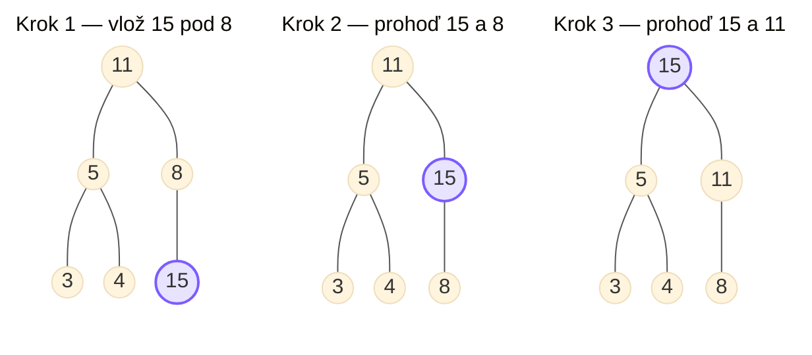

# Stromové datové struktury

> **Zadání:** Binární vyhledávací stromy, B-stromy, červeno-černé stromy, haldy, související operace a jejich složitost. Typické implementace, příklady použití. (IB002)

Definici stromů viz [[04-Grafy-prohledavani|4. otázka]].

# Binární vyhledávací strom (BVS)

> **BVS** je kořenový strom, kde má každý uzel nejvýše 2 potomky.

- Umožňuje rychlé vyhledávání, vkládání i odebírání.
- Uzly mají ukazatele na své následníky.
- Každý uzel reprezentuje hodnotu: **klíč**.

> **Platí, že:** klíč levého potomka $<$ klíč rodiče $<$ klíč pravého potomka.

- **Pokud BVS umožňuje duplicity, pak** levý potomek $<$ rodič $\leq$ pravý potomek.
- **Následníkem** uzlu $x$ je uzel, který obsahuje nejmenší klíč větší než v $x$.
- **Předchůdcem** uzlu $x$ je uzel, který obsahuje největší klíč menší než v $x$.

## Průchod celým stromem

- **preorder** $\Rightarrow$ vypíšu kořen, pak vše v levém potomkovi, pak vše v pravém potomkovi.
- **inorder** $\Rightarrow$ vypíšu vše v levém potomkovi, pak kořen, pak vše v pravém potomkovi (vypíše klíče **seřazeně**).
- **postorder** $\Rightarrow$ vypíšu vše v levém a pravém potomkovi, pak kořen.

## Operace

Všechny operace mají v nejhorším případě složitost $O(n)$ (strom není vyvážený).

- **Vyhledávání** probíhá rekurzivně $\Rightarrow$ podle hodnot klíčů jdu do levého / pravého potomka.
- **Vkládání** $\Rightarrow$ vyhledávám prvek, který chci vložit; jakmile narazím na prázdné místo, vložím ho tam.
- **Mazání:**
  - Pokud uzel nemá potomka, jednoduše ho smažu.
  - Pokud má 1 potomka, tento potomek nahradí smazaný uzel.
  - Pokud má 2 potomky, musí ho nahradit **následník** nebo **předchůdce**.

## Vyvážený BVS

Udržuje vyváženost $\Rightarrow$ všechny **listy** mají (přibližně) stejnou hloubku.

Z toho plyne, že hloubka uzlů je logaritmická $\Rightarrow \log_2(n+1)$.

- **Složitost operací je $O(\log n)$.**

V případě úprav struktury je nutno strom **vyvažovat** tak, aby se hloubka listů lišila maximálně o $1$. K tomu se využívá **rotace** v $O(1)$.

> **Využití:** vyhledávání, udržování seřazené posloupnosti dat.

Vyvážené BVS jsou např. **AVL stromy**, **RB stromy**…

- **AVL strom** je samovyvažující se implementace BVS.

# Červeno-černé stromy (RB tree)

> **Červeno-černý strom** je BVS splňující následující podmínky.

**Pravidla:**

1. Každý uzel je obarven červenou nebo černou barvou.
2. Kořen je černý.
3. Každý vnitřní uzel má 2 syny.
4. **Listy mají černou barvu a nenesou žádnou hodnotu** (NIL).
5. Všechny červené uzly mají černého rodiče (nemohou být dva červené uzly za sebou).
6. Cesty z každého uzlu do listů vždy obsahují stejný počet černých uzlů.

**Výška** vyváženého RB stromu $\Rightarrow 2\log_2(n+1)$.

> **Černá výška** $\Rightarrow$ počet černých uzlů na cestě z $x$ do listu (výchozí uzel se nepočítá).

- Každý uzel s výškou $h$ má černou výšku alespoň $h/2$.
- Všechny listy musí mít stejnou **černou výšku**.

Operace **Insert** a **Delete** nutně musí modifikovanou strukturu **balancovat**, aby nedošlo k porušení vyváženosti $\Rightarrow$ **rotace, složitost $O(1)$**.

## Rotace

Rotace zachovává uspořádání BVS a mění jen strukturu (výšku). `RightRotate(y)` a `LeftRotate(x)` jsou navzájem inverzní.

![[rb-tree-rotace.png|514]]

## Korekce po vložení uzlu

Nový uzel se vždy vloží jako **červený**; pokud má červeného rodiče, poruší se pravidlo 5 a strom se opravuje podle tří případů. Uzel $a$ je nový/opravovaný, $b$ jeho otec, $c$ praotec, $d$ strýc.

### Případ 1 — strýc je červený (přebarvení)

- uzel $a$ je červený, otec $b$ červený, **strýc $d$ červený**, praotec $c$ černý,
- $\Rightarrow$ obarvi otce $b$ a strýce $d$ **černou**, praotce $c$ **červenou** a pokračuj výš od $c$.

**Vlevo před, vpravo po** (přebarvení) — $c$ se obarví červeně, $b$ a $d$ černě, $a$ zůstává červený:

![[rb-tree-pripad-1.png|421]]
### Případ 2 — strýc černý, $a$ je „vnitřní" vnuk (rotace na případ 3)

- uzel $a$ je červený a je **pravým** synem svého otce, otec $b$ červený a je **levým** synem, strýc $d$ černý, praotec $c$ černý,
- $\Rightarrow$ proveď **levou rotaci** kolem otce $b$ a pokračuj případem 3.

**Vlevo před, vpravo po `LeftRotate(b)`** — $a$ se stane levým synem a strom se poruší stejně jako v případě 3 (pokračuj případem 3):

![[rb-tree-pripad-2.png|474]]
### Případ 3 — strýc černý, $a$ je „vnější" vnuk (rotace + přebarvení)

- uzel $a$ je červený a je **levým** synem svého otce, otec $b$ červený a je **levým** synem, strýc $d$ černý, praotec $c$ černý,
- $\Rightarrow$ proveď **pravou rotaci** kolem praotce $c$ a vyměň obarvení mezi otcem $b$ a jeho novým bratrem $c$.

**Vlevo před, vpravo po `RightRotate(c)` + přebarvení** — $b$ je nový kořeň podstromu a je černý, $a$ i $c$ jsou červené:

![[rb-tree-pripad-3.png|499]]

```
function RBInsert(T, a)
    BstInsert(T, a)
    a.color = red
    while a ≠ T.root ∧ a.parent.color == red do
        if a.parent == a.parent.parent.left then
            d = a.parent.parent.right       // strýc
            if d.color == red then
                // case 1
                a.parent.color = black
                d.color = black
                a.parent.parent.color = red
                a = a.parent.parent
            else
                if a == a.parent.right then
                    // case 2
                    a = a.parent
                    LeftRotate(T, a)
                // case 3
                a.parent.color = black
                a.parent.parent.color = red
                RightRotate(T, a.parent.parent)
        else
            // zrcadlově – záměna left ↔ right
    T.root.color = black
```

```
function LeftRotate(T, x)
    y = x.right
    if y is None then return
    x.right = y.left
    if y.left is not None then
        y.left.parent = x
    y.parent = x.parent
    if x.parent is None then
        T.root = y
    else
        if x == x.parent.left then
            x.parent.left = y
        else
            x.parent.right = y
    y.left = x
    x.parent = y
```

## Mazání (RB Delete)

Uzel ze stromu odstraníme stejným postupem jako z BVS.

- Pokud odstraněný uzel měl **červenou** barvu, vlastnosti stromu zůstávají zachované.
- Pokud měl **černou** barvu, může dojít k porušení vlastnosti 6 (stejná černá výška).
- Černou barvu z odstraněného uzlu **přesouváme směrem ke kořeni** tak, abychom obnovili platnost vlastnosti 6.

> **Využití:** implementace **asociativního pole** (hash-mapy, slovníku), rozhodovací stromy, implementace Dijkstrova algoritmu.

# B-stromy

> **B-stromy** jsou $n$-ární vyvážené vyhledávací stromy.

- Zachovávají BVS princip vyhledávání.
- Uzel s **$k$ klíči** má $k+1$ následníků.
- **Klíče vymezují intervaly**, do kterých spadají podstromy potomků.

> **Využití:** v databázových systémech (práce s velkým množstvím dat), tisíce klíčů v uzlu. Motivací je minimalizovat průchod stromem $\Rightarrow$ omezit čtení z disku.

**Minimální stupeň stromu $t$** určuje zároveň minimální i maximální počet klíčů v uzlu:

- **Minimální** $\Rightarrow t-1$ klíčů
- **Maximální** $\Rightarrow 2t-1$ klíčů
- **Hloubka** je $\log_t\!\big(\tfrac{n+1}{2}\big)$
- **Arita** je maximální počet potomků, čili $2t$

Všechny listy musí mít stejnou hloubku. Minimální počet uzlů po patrech (kořen má aspoň $1$ klíč $\Rightarrow$ $2$ potomky, každý další uzel aspoň $t-1$ klíčů $\Rightarrow$ $t$ potomků):

![[b-stromy.png|431]]

Obecně je na patře $i \geq 1$ minimálně $2t^{\,i-1}$ uzlů.

**Složitost operací je $O(\log_t n)$.**

Z důvodu využití v databázích se implementují operace tak, aby se uzly navštěvovaly nejvýše jednou.

## Optimalizace — preemptivní štěpení

- Při průchodu přes každý skoro plný uzel ho preventivně rozdělíme na 2 nové.
- Lze aplikovat jen na stromy sudé arity.
- Složitost operací se štěpením je $O(t \cdot \log_t n)$ ($t$ je složitost štěpení).

K preemptivnímu štěpení existuje také preemptivní **merge** (slučování).

## Štěpení uzlu

Plný uzel se prostřední klíč přesune do rodiče a uzel se rozdělí na dva. Např. plný uzel `P Q R S T U V` (mezi klíči $N$ a $W$ rodiče) se rozdělí na `P Q R` a `T U V`, prostřední klíč $S$ vystoupá do rodiče. **Před** ($S$ je prostřední klíč plného uzlu):

![[stepeni-uzlu.png|471]]

**Dělení kořene** zvyšuje výšku stromu. Plný kořen `A D F H L N P` se rozdělí a vznikne nový kořen s jediným klíčem $H$. **Před:**

![[deleni-korene.png|455]]
## Mazání

Mazání je podobné tomu v klasickém BVS.

- Klíč v listu lze jednoduše odstranit.
- Ve vnitřním uzlu ho nahrazuji **předchůdcem / následníkem**.
- Je ale nutné se vypořádat s **minimálním počtem klíčů** — při podtečení dochází k **mergi** uzlů (případně k vypůjčení klíče od sourozence).

**Příklad odstranění klíče $G$** (poruší minimální počet klíčů $t$) $\Rightarrow$ dojde k mergi uzlů — `[D E]` a `[J K]` se sloučí do `[D E J K]` a klíč $G$ z rodiče `C G L` zmizí:

![[odstraneni-klice-b-strom.png|386]]
# B+ stromy

> **B+ strom** je modifikací B-stromu, kde jsou **všechna data uložena v listech**.

- Klíče se sice nacházejí i ve vnitřních uzlech, ale jen kvůli určení intervalu potomků.

> **Využití** při implementaci souborového systému.

- Komplikuje operace vkládání a mazání, **akceleruje čtení**.
- Dodatečně se do listů přidává i **odkaz na následující list**, čímž se zvyšuje výkon při čtení kontinuálních dat.

![[bp-tree.png|423]]
## Rozdíly při štěpení / spojování

Na rozdíl od B-stromu je v B+ stromu štěpení/spojování závislé na tom, zda jsme v listu či ne.

- Pokud štěpím (spojuji) **list**, pak prostřední klíč **kopíruji** (nepřesouvám) do rodiče (nového listu). Navíc je tam aktualizace pointerů v listu.
- Tato operace v **uzlu** je pak stejná jako v B-stromu — klíče již **přesouvám**.

# Halda (heap)

> **Binární halda** je binární strom splňující **vlastnost haldy**.

Binární halda je buď úplně vyvážená, nebo má nekompletní spodní patro (plní ho zleva).

## Vlastnost haldy

- **Maximová halda** $\Rightarrow$ hodnota uzlu je $\geq$ hodnota syna.
- **Minimová halda** $\Rightarrow$ hodnota uzlu je $\leq$ hodnota syna.

## Reprezentace v poli

- Kořen na indexu $0$.
- **Levý** potomek na indexu $2i+1$.
- **Pravý** potomek na indexu $2i+2$.
- **Rodič**: $\lfloor (i-1)/2 \rfloor$.

## Operace

- **Insert**: $O(\log n)$ $\Rightarrow$ prvek se vloží na konec haldy a pak ho probubláváme nahoru.
- **Delete Root**: $O(\log n)$ $\Rightarrow$ poslední prvek se vloží na místo kořene a pak z něj voláme `Heapify`.
- **Search**: $O(n)$ $\Rightarrow$ hledání čísla menšího než $x$ je lineární.

| Operace | Složitost |
|---|---|
| Stavba haldy | $O(n)$ |
| Získání hodnoty kořene | $O(1)$ |
| Vyjmutí kořene | $O(\log n)$ |
| Vložení prvku | $O(\log n)$ |
| Odstranění prvku | $O(\log n)$ |
| Sloučení 2 hald | $O(n_1 + n_2)$ |

## Budování haldy

- Postupuje se od poloviny haldy směrem k uzlu $0$.
- Vždy se ověřuje vlastnost haldy a v případě porušení se problematický rodič vymění s potomkem $\Rightarrow$ tzv. **Heapify** se složitostí $O(h)$ dle hloubky opravovaného podstromu (**probublává dolů**).
- **Složitost budování haldy je $O(n)$.**

## Příklad — Insert čísla 15



## Heapsort

Haldou lze řadit (**heapsort**):

- Máme-li maximovou haldu, v kořeni je maximální prvek.
- Mohu opakovaně odebírat kořen a místo něj vkládat poslední prvek haldy `[size-1]` ($O(n)$).
- Po každém swapu je nutné zavolat Heapify na kořeni haldy ($O(\log n)$).
- **Výsledná složitost je $O(n \log n)$**, sort **není stabilní**, je **in situ**.

**Sloučení hald** $\Rightarrow$ zkopíruji obě do jednoho pole a vybuduji haldu $O(m+n)$.

## Využití

- Implementace **prioritní fronty** pomocí haldy.
- Kořen je maximum (maximální priorita) $\Rightarrow$ odeberu, nahradím posledním prvkem a zavolám `Heapify`.

# Hashovací tabulka

Reprezentace tabulkou $\Rightarrow$ každý prvek má klíč (ukazatel). Ukazatele přiděluje **hashovací funkce** (musí být deterministická).

**Kolize se řeší:**

- **Uzavřená adresace (zřetězení)** $\Rightarrow$ pod každým klíčem je Linked List.
  - **Insert** přidává prvek na začátek seznamu ($O(n)$ worst-case, průměrně $O(1)$).
  - **Search** má v nejhorším případě $O(n)$, zbytek $O(1)$.
- **Otevřená adresace** $\Rightarrow$ objekty se ukládají přímo do tabulky.
  - Při vyhledávání se **sonduje** (probing) tabulka, dokud nenalezneme klíč.
  - **Insert — lineární sondování** $\Rightarrow$ pokusí se vložit prvek, a pokud je pozice obsazena, jde lineárně dál, dokud nenajde volno.
  - **Delete** $\Rightarrow$ smaže klíč a vloží tam speciální hodnotu **Deleted** (Search přeskakuje Deleted).
  - **Kvadratické sondování** $\Rightarrow$ při kolizi se podívá na $\text{původní index} + (\text{počet kolizí})^2$.

# Otázky

**1.** Vysvětli, co je to BVS. Jak funguje vyvažování? Popiš scénáře odstranění. Co je to inorder, postorder a preorder?
> **Odpověď:** **BVS** je binární strom, kde pro každý uzel platí: levý podstrom má menší klíče, pravý větší. **Vyvažování** udržuje logaritmickou hloubku (listy se liší max. o 1) pomocí **rotací** v $O(1)$ (AVL, RB stromy). **Odstranění**: uzel bez potomka smažu; s 1 potomkem ho nahradí potomek; se 2 potomky ho nahradí **následník/předchůdce**. **Průchody**: preorder (kořen, levý, pravý), inorder (levý, kořen, pravý — vypíše seřazeně), postorder (levý, pravý, kořen).

**2.** Popiš, jak fungují RB stromy. Co to je? Jaké jsou jejich výhody? Vyjmenuj podmínky, které dodržují. Jak se vyvažují?
> **Odpověď:** **RB strom** je samovyvažující BVS, kde každý uzel je červený/černý. **Výhoda**: garantuje výšku $O(\log n)$, a tím $O(\log n)$ operace, s levnějším vyvažováním než AVL. **Pravidla**: (1) každý uzel červený/černý, (2) kořen černý, (3) listy (NIL) černé bez hodnoty, (4) červený uzel má černého rodiče, (5) všechny cesty z uzlu do listů mají stejný počet černých uzlů (černá výška). **Vyvažuje se** přebarvováním a **rotacemi** podle tří případů (strýc červený → přebarvení; strýc černý → rotace).

**3.** Co je to halda? Kolik paměti vyžaduje halda? Co je to vlastnost haldy? Jak probíhá search v haldě? Je heapsort stabilní?
> **Odpověď:** **Halda** je binární strom plněný zleva, splňující **vlastnost haldy** (rodič $\geq$ syn u maximové, $\leq$ u minimové). Paměť je **lineární** $O(n)$ — typicky **v poli** bez ukazatelů (potomci na $2i+1$, $2i+2$). **Search** je $O(n)$, protože halda neudržuje úplné uspořádání (jen vztah rodič–syn). **Heapsort není stabilní** (je ale $O(n\log n)$ a in situ).

**4.** Jak funguje B-strom? V čem je rozdíl oproti klasickému BVS? Kolik může být klíčů v každém uzlu?
> **Odpověď:** **B-strom** je $n$-ární vyvážený vyhledávací strom; uzel s $k$ klíči má $k+1$ potomků a klíče vymezují intervaly podstromů. **Rozdíl** oproti BVS: uzel drží více klíčů a má vyšší aritu $\Rightarrow$ menší hloubka a méně čtení z disku (proto se používá v databázích a souborových systémech). **Počet klíčů** podle minimálního stupně $t$: minimálně $t-1$, maximálně $2t-1$.
